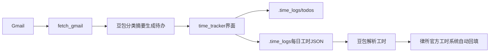

# 律师智能工时与待办助手（Time Tracker）
# 项目方案说明书

---

## 1. 项目背景

律师的日常工作高度依赖邮件往来与多项目并行推进。律师需按日、按项目在网站记录工时与工作内容，用于成本核算、客户账单与内部管理。

现实中，律师往往需要同时完成三件事：

1. 根据邮件与会议梳理当日待办；  
2. 在办案过程中实时或事后记录各项目用时；  
3. 日终或周终将零散记录整理后，再次手工填入官方系统。

上述环节大量依赖人工记忆与重复录入，既占用本可用于实质法律工作的时间，也容易出现遗漏、描述不完整或工时与事项对不上的问题。

本项目旨在打造一套面向律师的**本地桌面工时与待办助手**：以可编辑待办清单和按项目计时为核心，结合邮件只读拉取（现阶段以 Gmail 为效果参考）与豆包（Doubao / Ark）大模型能力，自动生成中英文待办；并在形成结构化每日工时日志后，**规划由豆包理解日志内容并自动回填方达官方 Tracker**，使律师尽可能从录入时间工作中解放出来，把时间还给专业工作本身。

---

## 2. 痛点分析

| 痛点 | 具体表现 |
|------|----------|
| 待办整理成本高 | 邮件多、项目多，手工归纳待办费时 |
| 邮件事项易遗漏 | 重要行动项埋在长线程中 |
| 休假后邮箱积压 | 长时间未查阅邮件（如休假）后收件箱爆满，逐封翻看成本极高 |
| 工时记录不连续 | 忙时忘开计时，事后靠回忆估算 |
| 中英文场景切换 | 涉外项目与中文沟通并存 |
| 官方系统二次录入 | 本地记完仍须在律所系统再填一遍 |
| 数据难以复用 | 纸笔或零散表格难以结构化 |

本项目针对以上痛点，优先解决「待办从邮件来、工时当场记、描述随项目走」，并进一步规划「日终日志一键交给 AI 填官方系统」，形成从工作发生到合规填报的减负闭环。尤其在律师因休假等原因长时间未处理邮件、邮箱大量积压时，可通过选定日期范围批量拉取与智能归纳，快速整理邮件并总结出待办事项，缩短「回岗消化邮件」的时间。

---

## 3. 技术方案

### 3.1 总体架构

| 层级 | 技术选型 | 说明 |
|------|----------|------|
| 桌面界面 | Python + CustomTkinter | `time_tracker.py`：首页、计时、待办、汇总、日历历史 |
| 邮件接入（演示） | Gmail API（OAuth 只读） | `fetch_gmail.py`：按日期范围拉取邮件，作效果参考 |
| 邮件接入（目标环境） | Outlook / Microsoft 365（待授权） | 律所工作邮箱；授权后方可对接，逻辑与现演示链路一致 |
| 智能处理 | 豆包 / 火山方舟 Ark API | 邮件分类、摘要、待办生成；规划用于工时回填 |
| 本地数据 | JSON 文件 | `.time_logs/` 下待办、工时、邮件缓存与语言设置 |

#### 关于邮件渠道的特别说明

律所律师日常办案邮件主要在 **Outlook（工作邮箱）** 中。因工作邮箱涉及客户资料与律所信息安全，**在未获得律所正式授权前，本项目不接入 Outlook**。现阶段采用个人或演示用 **Gmail** 完成「拉取 → 分类摘要 → 生成待办」全流程，用于验证产品效果与交互，证明技术方案可行；待 Outlook / Microsoft Graph 等接入获批后，可将同一套 AI 与待办合并能力迁移至工作邮箱，无需改变律师侧的使用习惯。

### 3.2 已实现能力

1. **每日待办与计时**  
   律师可按项目维护待办事项，对所选项目开始 / 结束 / 清零计时；收工后查看当日汇总，并支持调整用时。

2. **根据邮件生成待办（基于 Gmail 的效果演示）**  
   在工时页点击「根据邮件生成」，选择邮件日期范围（含首尾）与待办语言（中/英）。系统执行：拉取 **Gmail** → 豆包分类与摘要 → 豆包生成按项目分组的待办 → **合并**入当前清单（同名项目追加事项，不整表覆盖）。律师核对后保存。该链路用于展示效果；正式落地律所时，邮件源拟替换为已授权的 Outlook。

3. **中英文界面**  
   界面语言 EN/CN 可切换并本地记忆；生成待办的语言可与界面语言独立选择。

4. **结构化工时日志**  
   每日工时写入 `.time_logs/YYYY-MM-DD.json`，包含项目名称、累计用时及工作描述（来自待办事项文本），便于历史查阅与后续系统对接。

5. **工时历史**  
   日历高亮有记录的日期，支持查看与修正历史用时。

### 3.3 豆包自动回填律所官方 Tracker

**目标：** 律师完成本地记工并生成每日工时 JSON 后，无需再手工打开律所官方工时系统逐项填报。

**流程：**

1. 本工具产出当日（或指定日）结构化工时日志（项目、描述、用时等）；  
2. 将日志提交给豆包，由模型理解字段含义并映射为官方系统所需表单字段；  

**说明：** 当前代码库已具备合格的本地工时 JSON 产出。仅需律师将JSON产出交给豆包，告诉豆包在方达系统填入，豆包即可帮助实现填入，不需要手动逐日填报时间。

### 3.4 安全与合规要点

- 当前演示邮箱（Gmail）授权范围为**只读**，不代发邮件。  
- **不擅自连接律所 Outlook**；工作邮箱接入须经律所信息化 / 合规审批后再实施。  
- 待办、工时与邮件缓存默认保存在本机 `.time_logs/`。  
- 凭证与密钥（`credentials.json`、`token.json`、`.env` 中的 `ARK_API_KEY`）不得外传；已纳入 `.gitignore`。  

---

## 4. 创新点

1. **邮件驱动的双语待办生成**  
   律师自选日期范围与中/英输出语言，AI 按项目归类行动项，并与手工清单智能合并，减少遗漏与重复录入。现阶段以 Gmail 验证效果；架构上预留切换至律所 Outlook（授权后）的空间。

2. **待办—计时—描述一体化**  
   待办事项直接沉淀为工时描述，避免「先记时间、再补写做了什么」的割裂体验。

3. **结构化本地工时资产**  
   每日 JSON 同时包含项目、用时与描述，既服务律师自查，也为对接律所系统提供稳定数据源。

4. **中英双界面与双生成语言**  
   适配涉外与境内项目并存的真实办公场景。

5. **AI 贯通「记工 → 回填官方系统」闭环（规划）**  
   以豆包承接日终工时日志，自动填入律所官方 Tracker，直击律师最反感的二次填报痛点，显著节约非计费行政时间。

---

## 5. 应用场景

| 场景 | 使用方式 | 价值 |
|------|----------|------|
| 项目制律师日常办案 | 早间根据邮件生成待办，办案中按项目计时，晚间收工汇总 | 待办与工时同步、描述完整 |
| 休假后回岗 / 邮箱爆满 | 将「根据邮件生成」的日期范围设为休假期间（或更长区间），批量拉取并生成待办 | 快速梳理积压邮件，提炼行动项，避免逐封翻看 |
| 多项目并行 | 清单按项目分组，切换项目自动结束上一计时 | 降低串项、漏记风险 |
| 出差 / 非办公日补记 | 指定日期打开工具，按日历补看或调整工时 | 补记有据可依 |
| 涉外项目 | 界面中文、待办生成英文（或相反） | 降低语言切换成本 |
| 律所统一工时填报 | 本地日志齐全后，由豆包自动回填官方系统（规划） | 减少重复填报，提升合规及时率 |
| 团队管理抽查 | 结构化日志便于抽查描述是否达标 | 提升工时质量 |

---

## 6. 使用说明

### 6.1 环境准备（一次性）

1. 安装依赖：`pip install -r requirements.txt`  
2. 启动：`python time_tracker.py`（可选 `--lang cn` / `--lang en`）  
3. 若使用「根据邮件生成」（当前为 **Gmail 效果演示**，非律所 Outlook）：  
   - 配置 Gmail OAuth（`credentials.json`，首次浏览器授权生成 `token.json`）  
   - 在 `.env` 中配置 `ARK_API_KEY`  
   - 说明：律所 Outlook 工作邮箱未经授权，本阶段不接入；演示目的仅在于验证「邮件 → 待办」能力  

详细步骤见同目录《README.md》（中文用户说明）。

### 6.2 每日推荐流程

1. 打开程序 → 首页确认日期 → **开始工作！**  
2. （可选）**根据邮件生成**：选择邮件起止日期与待办语言 → 生成 → 核对 → **保存清单**  
3. 或手动 **编辑清单** 增删改项目与事项并保存  
4. 选择项目 → **开始 / 结束** 计时  
5. **今日收工！** 查看汇总，必要时修正用时  
6. 需要时在 **工时历史** 中查阅或调整过往日期  

### 6.3 数据位置（本机）

| 路径 | 内容 |
|------|------|
| `.time_logs/todos/YYYY-MM-DD.json` | 当日待办 |
| `.time_logs/YYYY-MM-DD.json` | 当日工时（含描述） |
| `.time_logs/emails/` | 邮件拉取与处理缓存 |
| `.time_logs/settings.json` | 界面语言等偏好 |

### 6.4 官方系统自动回填

1. 律师按上文完成当日计时，确保每日工时 JSON 已生成且描述完整；  
2. 触发「同步至律所系统」（功能落地后提供按钮或定时任务）；  
3. 系统将日志提交豆包解析，并自动填入官方 Tracker；  
4. 律师抽查同步结果；异常项支持手工修正后重试。  

**律师收益：** 无需再在官方系统中逐项抄录项目名称、工作描述与小时数，显著节约日终行政时间。

### 6.5 隐私提示

- 勿分享 `credentials.json`、`token.json`、`.env` 及含客户邮件的 `.time_logs/` 副本。  
- 仅在符合律所规定的前提下，对邮件与工时调用云端大模型。  
- 邮件生成失败或回填失败时，不清除本地已有待办与工时记录。

---

## 结语

本项目以律师真实工作流为中心，将「邮件待办—项目计时—结构化日志」落在轻量本地工具中，并以豆包大模型延伸至「自动回填律所官方工时系统」的规划目标。短期可立即减轻待办整理与记工负担；中期打通官方填报后，有望把律师从重复性行政录入中进一步解放出来，提升工时合规效率与执业体验。

